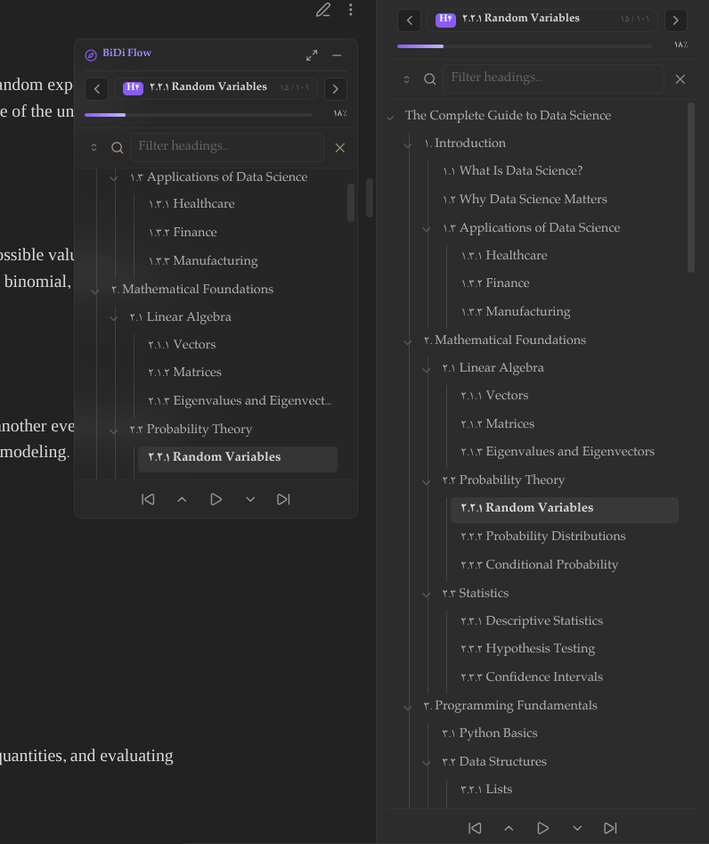
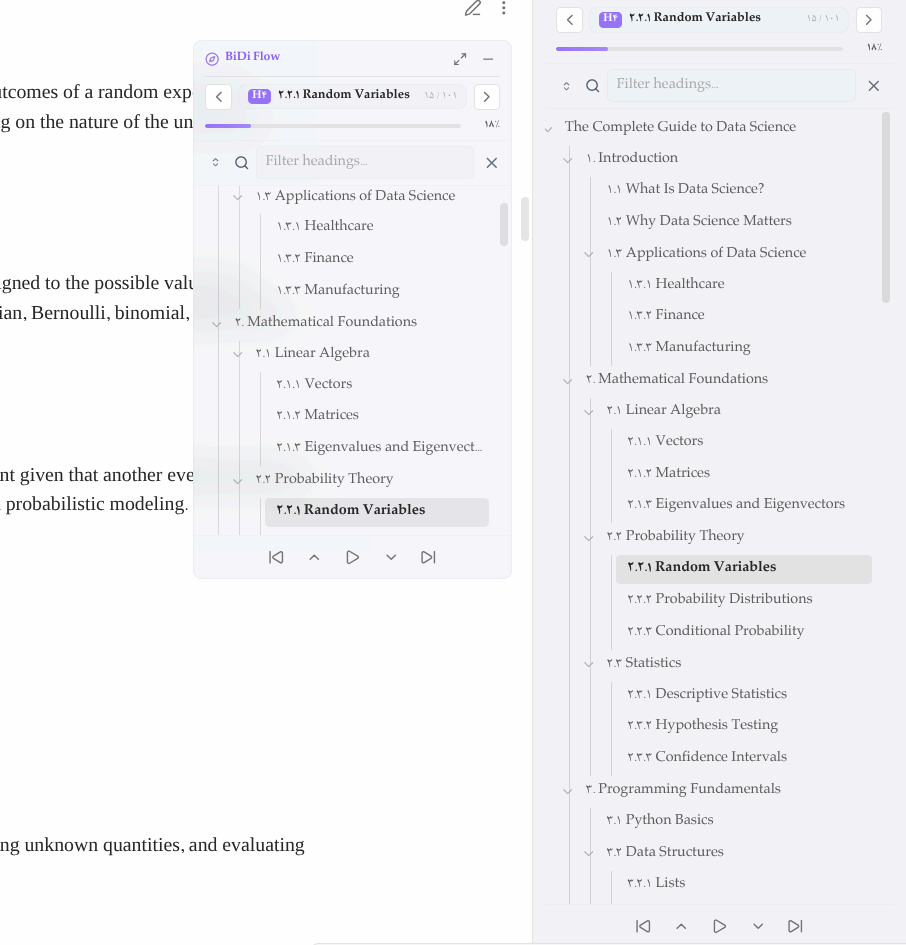
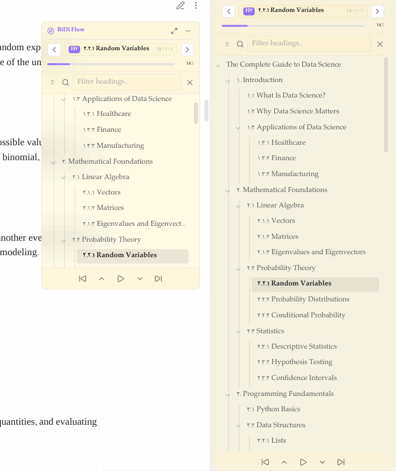
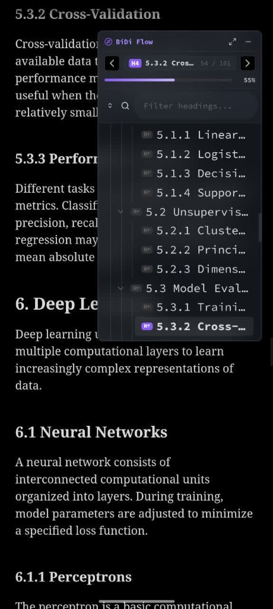
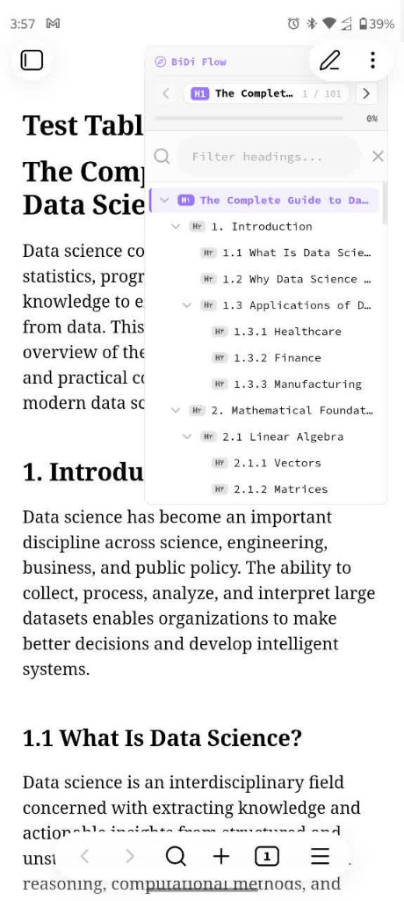
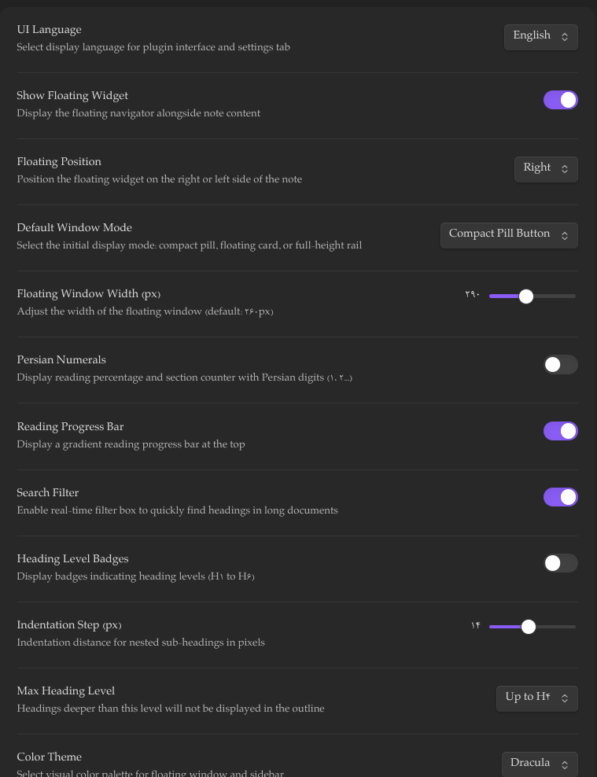

# BiDi Flow Navigator 🧭

[](https://obsidian.md)
[](LICENSE)
[](https://github.com/mohamad-javad/BCN-bidi-content-nvigator-/releases)
[](https://www.typescriptlang.org/)

**BiDi Flow Navigator** is a highly polished document outline and navigation plugin for [Obsidian](https://obsidian.md). Specifically built to handle **Bidirectional (BiDi) text (Persian, Arabic, and mixed RTL/LTR)** flawlessly, it provides heading tracking, section jumping, reading progress calculation, precise scroll memory across mode switches, customizable themes, and synchronized auto-scrolling across devices.

---

## ✨ Features

### 🔀 True Bidirectional & RTL Text Handling
- Built with modern CSS Logical Properties (`margin-inline-start`, `inset-inline-*`), `dir="auto"`, and Unicode bidirectional isolation rules.
- Correctly aligns and structures complex headings containing a mix of Persian, Arabic, English words, numbers, and technical terms.

### 🏃 Synchronized Auto-Scroll & 5-Button Toolbar
- **Symmetrical Action Toolbar:** A sleek bottom navigation bar containing:
  - `⏮️ Prev Sibling`: Jump backward across headings at the same or higher level.
  - `🔼 Prev Part`: Jump backward by page or section.
  - `▶️ Auto Scroll`: Smooth, continuous downward scroll with adjustable speed (10 to 200 px/s).
  - `🔽 Next Part`: Jump forward by page or section.
  - `⏭️ Next Sibling`: Jump forward to the next sibling or parent heading.
- **Cross-Window State Synchronization:** Toggling Auto-Scroll from the floating window, the right sidebar, or via the command palette synchronizes the play/pause state across all open panels instantly.
- **Sub-Pixel Motion Engine:** Uses float accumulators to prevent stuttering or truncation at lower reading speeds (10–30 px/s) in both Reading View and Editing View.
- **Smart Deep Navigation:** Sibling navigation on H1/H2 skips nested subheadings. For H3 and deeper headings, jumping can target the parent section or same-level siblings based on your preference.

### 🧠 Robust Position Memory & Mode Synchronization
- **Remember Last Heading:** Remembers your exact active reading location per note and restores it flawlessly when reopening files or restarting Obsidian.
- **Editing & Reading View Parity:** Employs a robust `scrollWithRetry` engine that monitors DOM readiness to keep your exact reading position completely perfectly synchronized when toggling between Live Preview/Source and Reading View.

### 🪟 Adaptable Window System
1. **Compact Pill (`mini`):** A tiny, distraction-free floating compass button docked in the corner.
2. **Floating Card (`floating`):** A compact floating card with quick controls, responsive height, and an interactive heading tree.
3. **Full-Height Rail (`full-height`):** Full-height side dock suitable for large desktop monitors.
- **Mobile-Tailored Ergonomics:** On mobile phones, the floating window automatically positions itself lower (`88px` from the top) to stay clear of app headers, uses a compact maximum height, and disables full-height expansion for clean touch navigation.

### 🎨 Visual Themes & Design
- **Color Themes:** Includes **Default Obsidian**, **Dracula**, **Nord**, **Solarized**, and **Gruvbox**.
- **Styles:** Choose between **Solid** and modern translucent **Glassmorphism** styling.
- **Minimalist Finish:** Clean, flat borders without heavy drop shadows for a native Obsidian feel.

### 📊 Outline Features
- **Reading Progress Bar:** Displays real-time reading progress with optional Persian digits (`۴۰٪`).
- **Heading Search:** Real-time filter that instantly auto-expands matching parent branches.
- **Section Indicator:** Displays the active heading with a level tag (`H1`–`H6`) and a counter (`۱۵ / ۱۰۱`).
- **Pure Bilingual UI:** Switch completely between English and Persian without mixed-language artifacts.

---

## 📸 Screenshots

### Desktop: Dual-Window Outline (Floating Card & Sidebar)

<p align="center">
  
  &nbsp;
  
  &nbsp;
  
</p>
<p align="center">
  <em>Floating card and right sidebar outline working together across Dark, Light, and Warm palettes with synchronized toolbars and Persian heading numerals.</em>
</p>

### Mobile View & Plugin Settings

<p align="center">
  
  &nbsp;&nbsp;
  
  &nbsp;&nbsp;
  
</p>
<p align="center">
  <em>Left & Center: Touch-friendly outline on phone devices with ergonomic top clearance. Right: Plugin configuration options.</em>
</p>

---

## 📥 Installation

### Using BRAT (Beta Releases)
1. Install the **Obsidian42 - BRAT** community plugin.
2. Under BRAT settings, select **Add Beta plugin**.
3. Enter repository URL:
   ```text
   https://github.com/mohamad-javad/BCN-bidi-content-nvigator-
   ```
4. Enable **BiDi Flow Navigator** under **Settings > Community plugins**.

### Manual Installation
1. Download `main.js`, `manifest.json`, and `styles.css` from the latest [Release](https://github.com/mohamad-javad/BCN-bidi-content-nvigator-/releases).
2. Create a folder named `bidi-flow-navigator` in your vault at `.obsidian/plugins/bidi-flow-navigator/`.
3. Copy the downloaded files into that folder.
4. Reload Obsidian and enable the plugin in Community Plugins.

---

## ⌨️ Commands

| Command | Action |
| :--- | :--- |
| **Open in Sidebar** | Opens the heading outline in the right sidebar. |
| **Toggle Auto Scroll** | Starts or stops synchronized auto-scrolling. |
| **Jump to Next Part** | Advances by a page or to the next heading. |
| **Jump to Previous Part** | Moves back by a page or to the previous heading. |
| **Jump to Next Sibling** | Advances to the next sibling or parent heading. |
| **Jump to Previous Sibling** | Moves back to the previous sibling or parent heading. |
| **Jump to Next Section** | Scrolls directly to the next document heading. |
| **Jump to Previous Section** | Scrolls directly to the previous document heading. |
| **Toggle Floating Navigator** | Toggles between mini pill and floating card. |
| **Cycle Window Mode** | Switches window display modes. |

---

## ⚙️ Settings Reference

- **UI Language:** Select interface language (**English** or **فارسی**).
- **Show Floating Widget:** Enable or disable the floating note outline.
- **Floating Position:** Dock the floating widget on the **Right** or **Left** side.
- **Default Window Mode:** Set initial mode (**Floating Card**, **Compact Pill**, or **Full-Height**).
- **Floating Window Width:** Adjust card width (200px to 420px).
- **Color Theme:** Select color palette (**Default**, **Dracula**, **Nord**, **Solarized**, **Gruvbox**).
- **Theme Style:** Choose between **Solid** and **Translucent**.
- **Bottom Action Toolbar:** Toggle visibility of the 5-button bottom action bar.
- **Auto Scroll Speed:** Set scroll rate in pixels per second (10 to 200 px/s).
- **Deep Heading Jump Target:** Choose whether deeper headings (H3+) jump to their **Parent Heading** or **Sibling Heading**.
- **Remember Last Heading Position:** Automatically return to the last active heading when reopening notes.
- **Persian Numerals:** Display counters and percentages in Persian digits (`۱، ۲، ۳...`).
- **Reading Progress Bar:** Show or hide the top progress bar.
- **Search Filter:** Enable or disable heading search.
- **Heading Level Badges:** Show or hide colored badges for `H1`–`H6`.

---

## 📅 Changelog

### v1.2.2
- **Robust Scroll Architecture:** Completely overhauled the scrolling engine with a robust retry mechanism (`scrollWithRetry`) that guarantees correct scroll position restoration.
- **Smart Mode Switching:** Fixed the jump-to-top bug that occurred during the first mode switch between Live Preview and Reading View. The plugin now smartly detects Obsidian's native scroll state and intelligently steps in to restore the previous heading if Obsidian fails to sync properly due to unmounted DOM elements.
- **Polished Default Settings:** Updated default settings to feature the 'Nord' transparent theme and 'Mini' default window mode.

### v1.2.1
- **Popout Window Compatibility:** Standardized all frame scheduling calls to `window.requestAnimationFrame()` and `window.cancelAnimationFrame()`.
- **CSS Quality Standards:** Eliminated all `!important` declarations by enhancing selector specificity in mobile responsive rules.
- **Mobile Comfort Height:** Adjusted mobile floating card maximum height to 420px for balanced outline visibility and note reading.

### v1.2.0
- **Unified Auto-Scroll:** Synchronized auto-scroll state across the floating window, sidebar view, and command palette.
- **Symmetrical 5-Button Toolbar:** Added quick-action navigation controls (`Prev Sibling`, `Prev Part`, `Auto Scroll`, `Next Part`, `Next Sibling`).
- **Sub-Pixel Motion Engine:** Fixed scrolling in Reading View (`.markdown-preview-view`) and implemented sub-pixel accumulation for smooth movement at speeds below 30 px/s.
- **Smart Deep Heading Navigation:** Added setting to jump to parent headings when navigating nested sections (H3+).
- **Mobile Ergonomics:** Lowered floating widget position on mobile phones (`top: 88px`), reduced maximum card height, and disabled full-height expansion on mobile screens.

### v1.1.11
- **Heading Memory:** Remembers active reading heading per note across sessions.
- **Mode Switching Parity:** Fixed position loss when toggling between Live Preview and Reading View.
- **Localized Themes:** Standardized theme names to match the active UI language.
- **Mobile Polish:** Refined touch handling and card sizing on mobile devices.

### v1.1.0
- **Theme Palettes:** Added Dracula, Nord, Gruvbox, Solarized, and Default themes.
- **Visual Styles:** Added Solid and Translucent (Glassmorphism) styles.
- **Language Switcher:** Instant runtime switching between Persian and English.

### v1.0.1
- **Core Release:** 3-mode window system (Mini Pill, Floating Card, Full-Height Rail), bidirectional outline parser, reading progress bar, heading search, and sidebar integration.

---

<details>
<summary>🇮🇷 <strong>راهنمای فارسی و گزارش تغییرات (Persian Documentation)</strong></summary>

### افزونه هدایت‌گر هوشمند بخش‌های سند (BiDi Flow Navigator)

**BiDi Flow Navigator** افزونه‌ای برای مدیریت و مرور ساختار سرتیترها در نرم‌افزار Obsidian است که با تمرکز بر متون دوجهته و راست‌به‌چپ (فارسی، عربی و ترکیب با انگلیسی) توسعه یافته است.

#### ویژگی‌های کلیدی:
1. **پشتیبانی اصولی از متون فارسی و دوجهته (RTL/LTR):** چینش طبیعی و منظم سرتیترها با رعایت قواعد متون دوزبانه، اصطلاحات فنی و اعداد.
2. **نوار ناوبری ۵ دکمه و اسکرول خودکار هماهنگ:**
   - دسترسی سریع به سرتیتر قبلی، بخش قبلی، اسکرول خودکار در مرکز، بخش بعدی، و سرتیتر بعدی.
   - همگام‌سازی وضعیت اسکرول خودکار میان پنجره شناور و نوار کناری (Sidebar).
   - اسکرول پیوسته و روان با دقت زیرپیکسل در هر دو نمای مطالعه و ویرایش با امکان تنظیم سرعت از ۱۰ تا ۲۰۰ پیکسل بر ثانیه.
   - رفتار هوشمند پرش بین سرتیترها (رد شدن از زیربخش‌ها در H1/H2 و امکان هدایت به سرتیتر والد در تیترهای سطح ۳ به بالا).
   - بهینه‌سازی اختصاصی برای گوشی: قرارگیری در ارتفاع مناسب (`88px`) برای عدم تداخل با منوهای بالای گوشی، ارتفاع کوتاه‌تر کارت و حذف دکمه تمام‌صفحه در موبایل.
3. **حافظه هوشمند موقعیت مطالعه:** ذخیره سرتیتر فعال هر یادداشت و بازیابی بی‌نقص و دقیق آن در هنگام باز کردن مجدد فایل و یا جابجایی بین نمای ویرایش (Live Preview) و نمای مطالعه (Reading View).
4. **حالت‌های نمایش انعطاف‌پذیر:** حالت دکمه کوچک شناور (Pill)، کارت شناور (Floating) و پنل تمام‌قد (Full-Height).
5. **تم‌ها و سبک‌های بصری:** تم‌های دراکولا، نورد، سولارایزد، گرووباکس و پیش‌فرض با حالت‌های مات و شیشه‌ای.
6. **امکانات ساختاری:** نوار درصد پیشرفت مطالعه با ارقام فارسی، فیلتر آنی سرتیترها و نشانگر بخش فعال.
7. **محیط کاملاً دوزبانه:** امکان انتخاب مستقل زبان فارسی یا انگلیسی برای تمامی بخش‌ها و تنظیمات افزونه.

</details>

---

## 📜 License

This project is licensed under the [MIT License](LICENSE).
