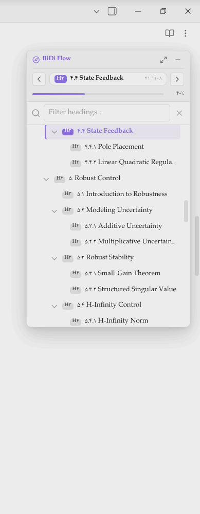
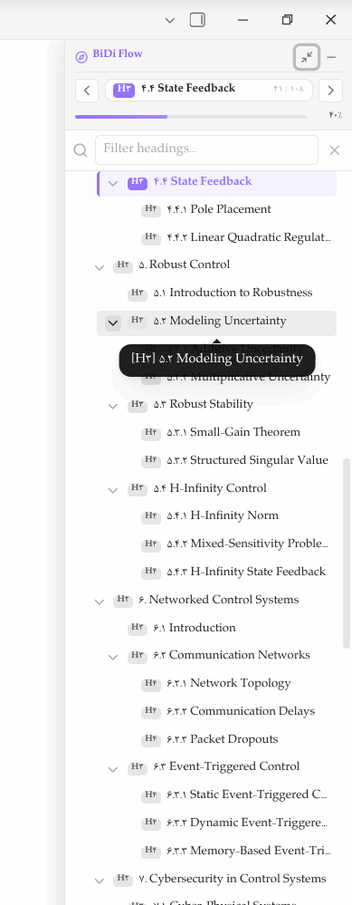

# BiDi Flow Navigator 🧭

[](https://obsidian.md)
[](LICENSE)
[](https://github.com/mohamad-javad/BCN-bidi-content-nvigator-/releases)
[](https://www.typescriptlang.org/)

**BiDi Flow Navigator** is a modern, high-performance document heading outline and navigator plugin for [Obsidian](https://obsidian.md). Engineered with first-class support for **Bidirectional (BiDi) typography (Persian, Arabic, and mixed RTL/LTR)**, it provides smooth section-by-section navigation, real-time scroll-spy, a 3-mode flexible window system, reading progress calculation, and instant search.

---

## 📸 Screenshots & Showcase

<p align="center">
  
  &nbsp;&nbsp;&nbsp;&nbsp;
  
</p>
<p align="center">
  <em>Left: Floating Card mode with heading tree, reading progress bar & search. Right: Native tooltip preview on long heading hover.</em>
</p>

<p align="center">
  
  &nbsp;&nbsp;&nbsp;&nbsp;
  
</p>
<p align="center">
  <em>Left: Compact Mini Pill mode floating seamlessly in note corner. Right: Clean settings panel with instant language switcher.</em>
</p>

---

## ✨ Key Features

- **🌐 First-Class BiDi & RTL Typography:**
  Built with modern CSS Logical Properties (`margin-inline-start`, `border-inline-start`, `inset-inline-*`), `dir="auto"`, and `unicode-bidi: plaintext`. Seamlessly handles Persian, Arabic, English, code snippets, numbers, and compound technical terms.

- **🪟 3-Mode Window System:**
  1. **Compact Pill (`mini`):** A sleek circular floating compass button in the note corner when you need distraction-free writing.
  2. **Floating Card (`floating`):** Modern glassmorphism floating card with soft shadows, responsive height, and quick actions.
  3. **Full-Height Rail (`full-height`):** Full vertical editor height dock for extensive long-form writing and research.
  - Switch between modes with one click using the header window control buttons (`maximize-2` / `minus`).

- **🎯 60fps Scroll-Spy Engine:**
  - Accurately tracks your position in both **Live Preview / Source Mode** (via CodeMirror 6 document height-map measurements) and **Reading View**.
  - High-performance binary search $O(\log N)$ with `requestAnimationFrame` debouncing ensures zero lag even in 10,000+ line notes.

- **📊 Continuous Reading Progress Bar:**
  - Real-time reading progress bar calculated from actual CodeMirror scroller geometry.
  - No abrupt 0% to 100% jumps — smooth, accurate progress across the entire note.
  - Formatted with Persian digits (`۴۰٪`) or standard numerals (`40%`).

- **🧭 Active Section & Jump Bar (Prev / Current / Next):**
  - Displays the active heading with its level badge (`H1`–`H6`).
  - Next/Previous jump buttons (`‹` / `›`) with heading tooltips for instantaneous keyboard and mouse jumping.
  - Active section counter (e.g. `۴۱ / ۱۰۸`).

- **🔍 Real-Time Heading Filter & Search:**
  - Filter through hundreds of headings instantly.
  - Auto-expands matching branches while typing.

- **🔤 Clean Language Localization (English / فارسی):**
  - Instant toggle between pure **English** and pure **Persian**.
  - All UI elements, window controls, tooltips, commands, and settings re-render immediately upon selection. No awkward mixed bilingual slashes.

- **🎨 Native Obsidian Aesthetics:**
  - Blends seamlessly into Obsidian’s light and dark themes, inheriting CSS variables for colors, typography, borders, and shadows.

---

## 📥 Installation

### Method 1: Using BRAT (Recommended for Beta)
1. Install the **Obsidian42 - BRAT** community plugin.
2. In BRAT settings, click **Add Beta plugin**.
3. Enter this repository URL:
   ```text
   https://github.com/mohamad-javad/BCN-bidi-content-nvigator-
   ```
4. Click **Add Plugin** and enable **BiDi Flow Navigator** in Obsidian's Community Plugins list.

### Method 2: Manual Installation
1. Download `main.js`, `manifest.json`, and `styles.css` from the latest [GitHub Release](https://github.com/mohamad-javad/BCN-bidi-content-nvigator-/releases).
2. Create a folder named `obsidian-bidi-navigator` inside your vault:
   ```bash
   <Your-Vault>/.obsidian/plugins/obsidian-bidi-navigator/
   ```
3. Copy the downloaded files into that folder.
4. Reload Obsidian (`Ctrl + R`) and enable **BiDi Flow Navigator** under **Settings > Community plugins**.

---

## ⌨️ Command Palette

Press `Ctrl + P` (or `Cmd + P` on macOS) to access plugin commands:

| Command | Description |
| :--- | :--- |
| **Open in Sidebar** | Opens the heading navigator in the active sidebar leaf. |
| **Jump to Next Section** | Scrolls the editor to the next document heading. |
| **Jump to Previous Section** | Scrolls the editor to the previous document heading. |
| **Toggle Floating Navigator** | Toggles the floating widget between minimized pill and expanded card. |
| **Cycle Window Mode** | Cycles through the 3 modes: Mini Pill ➔ Floating Card ➔ Full-Height Rail. |

---

## ⚙️ Configuration

In Obsidian **Settings > BiDi Flow Navigator**:

- **UI Language:** Choose between pure **Persian (فارسی)** or **English**.
- **Show Floating Widget:** Toggle floating widget alongside markdown notes.
- **Floating Position:** Snap widget to the **Right** or **Left** side of your notes.
- **Default Window Mode:** Choose default initial mode (**Floating Card**, **Compact Pill**, or **Full-Height**).
- **Floating Window Width:** Customize width from 200px to 420px (default: 260px).
- **Persian Numerals:** Display percentage and section counters in Persian digits (`۱، ۲، ۳...`).
- **Reading Progress Bar:** Show/hide the top progress indicator.
- **Search Filter:** Enable/disable real-time heading search input.
- **Heading Level Badges:** Display colored tags for `H1`–`H6`.
- **Indentation Step:** Adjust indentation distance for nested sub-headings (in pixels).
- **Max Heading Level:** Filter headings deeper than specified level (up to H6).

---

<details>
<summary>🇮🇷 <strong>راهنمای فارسی (Persian Documentation)</strong></summary>

### افزونه هدایت‌گر هوشمند بخش‌های سند (BiDi Flow Navigator)

**هدایت‌گر BiDi** یک افزونه پیشرفته و اختصاصی برای نرم‌افزار Obsidian است که فهرست بخش‌ها و سرتیترهای یادداشت‌های شما را شناسایی کرده و تجربه‌ای روان و شیک از ناوبری محتوا ارائه می‌دهد.

#### قابلیت‌های برجسته:
1. **پشتیبانی تراز اول از زبان فارسی و چینش راست‌به‌چپ (BiDi & RTL):** تنظیم خودکار جهت متن، مهار کلمات طولانی، و عدم به‌هم‌ریختگی چینش با اصطلاحات انگلیسی یا کدهای فنی.
2. **سیستم پنجره ۳ حالته:**
   - **دکمه کوچک شناور (Pill):** دکمه گرد و ظریف قطب‌نما در گوشه یادداشت برای تمرکز کامل بر نوشتن.
   - **پنجره شناور کارت (Floating):** کارت شیشه‌ای مدرن با سایه ملایم و کنترل سریع.
   - **تمام‌قد به اندازه کل صفحه (Full-Height):** پنل عمودی متصل به لبه صفحه مناسب اسناد بسیار طولانی.
3. **موتور اسکرول اسپای ۶۰ فریم:** تشخیص لحظه‌ای بخش فعال هنگام اسکرول با سرعت فوق‌العاده در هر دو نمای Live Preview و Reading View.
4. **نوار پیشرفت مطالعه پیوسته:** محاسبه دقیق درصد خواندن یادداشت بدون پرش‌های ناگهانی.
5. **نوار هدایت سه‌گانه (قبلی / جاری / بعدی):** دکمه‌های پرش مستقیم به بخش‌های پیشین و پسین سند همراه با تولتیپ بومی ابسیدین.
6. **فیلتر و جستجوی آنی در عناوین:** فیلتر سریع سرتیترها همراه با باز شدن خودکار شاخه‌ها.
7. **قابلیت تغییر کامل زبان (فارسی / انگلیسی):** انتخاب زبان مستقل برای کل محیط افزونه و صفحه تنظیمات بدون ترکیب نامناسب متن‌های دوزبانه.

</details>

---

## 🛠️ Development & Building

To build the plugin from source:

```bash
# Clone the repository
git clone https://github.com/mohamad-javad/BCN-bidi-content-nvigator-.git
cd BCN-bidi-content-nvigator-

# Install dependencies
npm install

# Start development mode with auto-rebuild
npm run dev

# Build production bundle
npm run build
```

This bundles the source into production-ready `main.js` and `styles.css`.

---

## 📄 License

This project is licensed under the [MIT License](LICENSE).

---

## 🤝 Contributing

Contributions, issues, and feature requests are welcome! Feel free to check the [issues page](https://github.com/mohamad-javad/BCN-bidi-content-nvigator-/issues).
